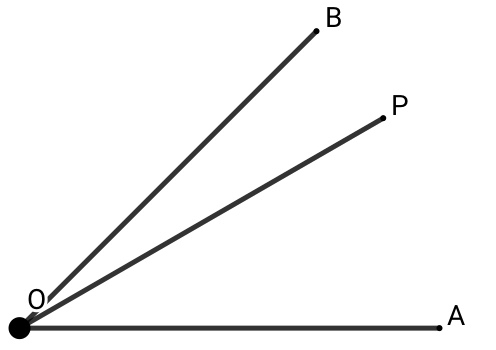
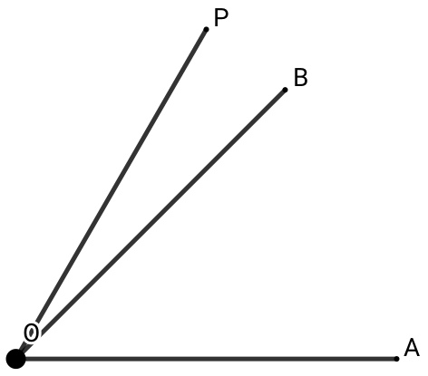

# 正切妙用
## 声明
本文以CC0 1.0许可声明. 这意味着您可以复制、修改、分发和执行，即使是出于商业目的，所有这些都无需征求许可.  
要查看此许可的副本, 请访问 http://creativecommons.org/publicdomain/zero/1.0

本文已上传至 https://github.com/jasonxue1/tangent-magic-uses , 可以访问该网址以第一时间获得更新.  
## 简介
此处仅讨论锐角三角比, 不涉及零角、直角等其他角度的三角比.  
本技巧性内容适用于填空题快速运算, 不得直接用于解答题书面书写.  
所有结论均可以使用三角函数差角公式进行严谨地证明.  
## 三角函数差角公式
$tan(\alpha\pm\beta)=\frac{tan(\alpha)\pm tan(\beta)}{1\mp tan(\alpha)tan(\beta)}$
## 技巧实例
1. $45\degree$和差  
    1. 如图$\angle AOB=45\degree$, $OP$为$\angle AOB$内部射线, 记$\angle AOP=\alpha$, $\angle BOP=\beta$,  
        则$tan(\alpha)$与$tan(\beta)$的关系可表示为$\begin{cases}\tan(\alpha)=\frac{n-1}{n+1}\\tan(\beta)=\frac{1}{n}\end{cases}$  
        特殊地:   
            $n=2$时$\begin{cases}\tan(\alpha)=\frac{1}{3}\\tan(\beta)=\frac{1}{2}\end{cases}$,  
            $n=4$时$\begin{cases}\tan(\alpha)=\frac{3}{5}\\tan(\beta)=\frac{1}{4}\end{cases}$,  
            $n=5$时$\begin{cases}\tan(\alpha)=\frac{2}{3}\\tan(\beta)=\frac{1}{5}\end{cases}$, 
            $n=7$时$\begin{cases}\tan(\alpha)=\frac{3}{4}\\tan(\beta)=\frac{1}{7}\end{cases}$.  
    2. 如图$\angle AOB=45\degree$, $OP$为$\angle AOB$外部射线, 但满足$\angle AOP<90\degree$, 记$\angle AOP=\alpha$, $\angle BOP=\beta$,  
        则$tan(\alpha)$与$tan(\beta)$的关系可表示为$\begin{cases}\tan(\alpha)=\frac{n+1}{n-1}\\tan(\beta)=\frac{1}{n}\end{cases}$  

## 总结
注: 为方便表述, 使用$arctan(x)$函数, 该函数为正切函数$tan(x)$的反函数, 如$arctan(1)=45\degree$, $arctan(\frac{\sqrt3}{3})=30\degree$等
1. $arctan(\frac{n-1}{n+1})+arctan(\frac{1}{n})=45\degree$, $n>1$
2. $arctan(\frac{n+1}{n-1})-arctan(\frac{1}{n})=45\degree$, $n>1$
